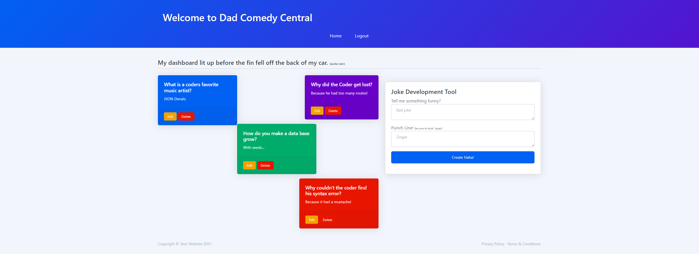

# The Dadabase 🗂️
We have created an application where friends with an account will be able to read and post dad jokes!

# About
Our application was mainly developed in the backend and made use of NodeJs and ExpressJs to create a RESTful API. Handlebars.js was used as our visual template to facilitate the generation of our application in the frontend. Our application also made use of MYSQL for the purpose of creating our database which contains a list of jokes and puns. This app is by subscription only thus any new user will be prompted to be authenticated via user login and a user logout.

# Deployment 🚀
Our app was deployed through Heroku.

Contribute to commedy and check it out yourself!| https://the-dadabase.herokuapp.com

# Preview 📷

# Resources and Credits 📣
Node.Js and RESTful API https://www.tutorialspoint.com/nodejs/nodejs_restful_api.htm

HandleBars https://handlebarsjs.com/guide/#what-is-handlebars

# Contributors 🤝
Kevin Doolittle <a href= "https://github.com/Doolittle28">@Doolittle28</a> 

Caleb Norcross <a href= "https://github.com/CalebNorcross">@CalebNorcross</a> 

Mike Walker <a href= "https://github.com/Skyw41k3r">@Skyw41k3r</a> 

Leandro Machado <a href= "https://github.com/lamachad">@lamachad</a>
